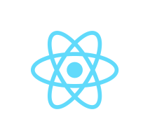
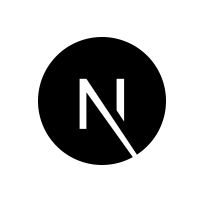
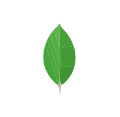
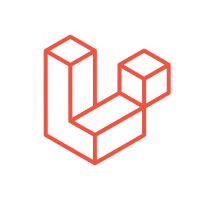
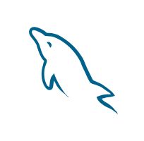
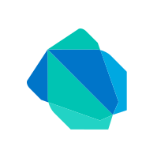
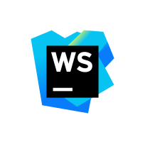
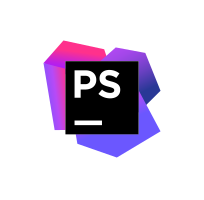
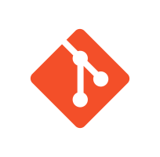

# Rabbil Hasan 
### Software Engineering Manager

 

  
  
  

 

### Love to code

  
  
  
  
  
  
  
  
  
  
  
  
  
  

### Favourite Tools

###  Open Source Contribution Going:

<table>
<tbody>
<tr>
<td>

</td>

<td>

</td>
</tr>

<tr>
<td>

</td>

<td>

</td>
</tr>

</tbody>

</table>

